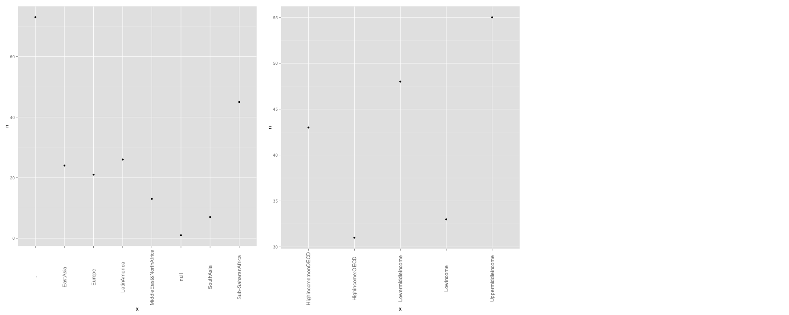

Project 3
====
**Group members: Fabiana Latorre, Oliver Benton Javier, Ernesto Canales, and Nikolaj Plagborg-Moller.**  
  
Our datasets can be found at: 
'http://catalog.data.gov/dataset/international-food-security',
'http://catalog.data.gov/dataset/annual-electricity-generation-1980-2009-dff2e',
'http://data.un.org/Data.aspx?q=GNI+Country&d=SOWC&f=inID%3a94',
'http://visualizing.org/sites/default/files/data_set/Marc%20Schwartz/HDR_2010_dataset.zip',
'http://www.facebook.com/l.php?u=http%3A%2F%2Fdata.worldbank.org%2Fabout%2Fcountry-and-lending-groups&h=0AQHX1bNI'.
  
Since our data is listed by country, there are not thousands of rows in every data set. We asked in class if this was okay and had it approved.
  
We load the data-tables into the corresponding variables, food (for food security data), electricity (for electricity generation data), GNI (for gross national income data), HDI (for human development index data), income (for income categorical data), and display a subset of each data set.
  
```{r}
source('../01 Data/Fetching_Data.R', echo=TRUE)
```
  
We modify (wrangle) the food security data, so that we only have the population numbers in millions for each country for the year 2005. Furthermore, 2005 is also selected from the electricity generation data, and the columns of both datasets are renamed appropriately. The two resulting tables are joined using an inner join on the "Country" column and we display a subset of the resulting table below.
  
```{r}
source('../02 Data Wrangling/Wrangling1.R', echo=TRUE)
```

We chose to plot generated electricity versus population and have country name as the legend. Since there are many countries in our joined data frame, the legend would be very long, so we filtered out countries that have an electricity production above 50 billion kilowatthours. Furthermore we formatted the colors, axis, and title of the plot.
  
```{r}
source('../03 Visualizations/Visualization1.R', echo=TRUE)
```

From this subset of the data at the bottom of the electricity production scale, there appears to be no meaningful correlation between population size and the amount of generated electricity.

For our second data wrangling we use information about gross national income. First we assign a variable to the worflow so that we can access it later. Next we used the select and filter functions to narrow down the criteria to seven countries and the year 2011. After we used the distinct function to remove any duplicate rows. Next, we assigned another variable for our joined data set. Then we used the select and filter functions to narrow down the criteria to six countries and the year 2011. Next we used the full_join function to combine both data sets by country and year. Lastly we used the distinct function to remove any duplicate rows.

```{r}
source('../02 Data Wrangling/Wrangling2.R', echo=TRUE)
```
  
In order to make the visualization for gross national income, we assigned country names as the x-axis values and amount in US dollars as the y value. Then we used the geom_bar function to create a bar graph of the data. Next we formatted the axis labels, theme, text vertical orientation, adjusted position, and changed the background color.
  
```{r}
source('../03 Visualizations/Visualization2.R', echo=TRUE)
```
  
We implemented a full join to combine both data sets because we wanted to include the 7 countries that are in the first dataset along with the 6 countries that are in the second dataset. After visualizing the output, it makes sense that one of the countries, Lesotho, is missing information since the full join did not find a match for this record.

For our third data wrangling, we took from our previous dataset, Food Aid, information about 6 different developing countries. We used the spread function to set the years as separate columns in order for them to match our new dataset, which has net savings. We filtered the same 6 countries from our new dataset and assigned that table as a new variable, to which we applied a bind_cols().
  
```{r}
source('../02 Data Wrangling/Wrangling3.R', echo=TRUE)
```
  
We then created two separate graphs for 2000 and 2008 data and joined them using pushViewport(). The scaling in the x axis was formatted to match both graphs.
  
```{r}
source('../03 Visualizations/Visualization3.R', echo=TRUE)
```
  
We concluded from looking at the graphs that in 2000, countries with the least Saving Rates received the most amount of food aid. In 2008, however we saw a dramatic decrease of Food Aid for ALL countries, therefore indicating that either food aid is becoming less popular or countries are quickly developing into independent nations that do not require aid anymore.

Regarding categorical data, we did not have any useful categoriclas in our previously used tables, so we found a new table assigning countries to certain income groups. Unfortunately, this dataset did not have non-categoricals, but we have already demonstrated a histogram earlier in this assignment. The process of creating the histograms would be almost identical to how we made plots of the categorical data. Since the first column in this data set has country names, the quantification of this data is useless since every country is represented once. We therefore chose to exclude it from the png file, but it still appears by itself below since we could not get rid of it by setting "echo = false"" in the source command.

```{r}
source('../03 Visualizations/Categoricals.R', echo=FALSE)
```
  
Here is our png-file.
  
